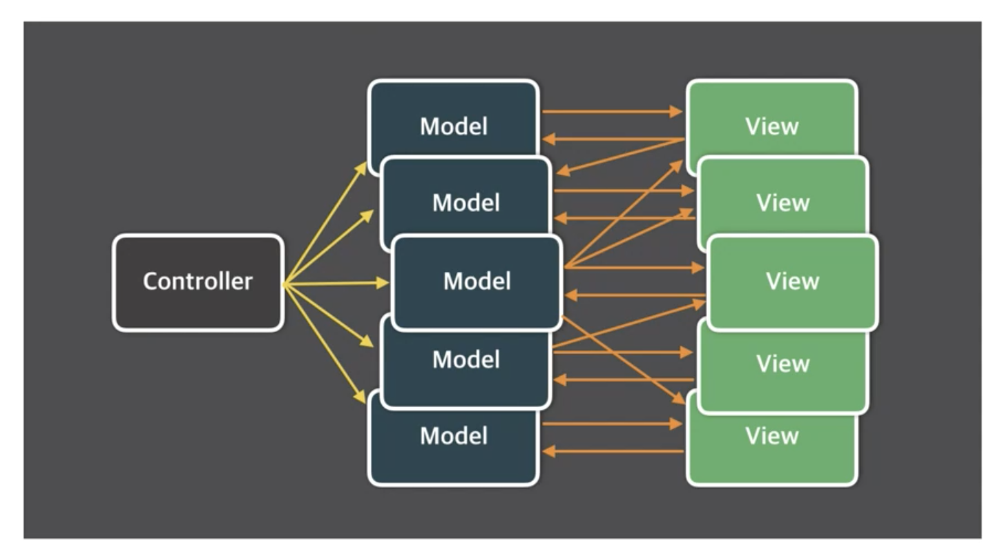

# 11. Vuex - 소개

- [11. Vuex - 소개](#11-vuex---소개)
  - [개요](#개요)
  - [Vuex 란](#vuex-란)
  - [MVC 패턴의 문제점](#mvc-패턴의-문제점)
  - [Flux 란](#flux-란)
  - [Vuex 가 왜 필요할까](#vuex-가-왜-필요할까)
    - [Vuex로 해결할 수 있는 문제](#vuex로-해결할-수-있는-문제)
    - [Vuex 컨셉](#vuex-컨셉)
    - [Vuex 구조](#vuex-구조)

## 개요

- 복잡한 앱의 수많은 컴포넌트들을 효율적으로 관리하기 위해 Vuex를 사용
- 라이브러리 + 상태관리
- Vuex lib. 등장 배경인 Flux 패턴 소개
- Vuex 주요 속성 학습
  - state: data
  - getters: computed
  - mutations: methods
  - actions: async methods
- Vuex 더쉽게 짜는 Helper 기능 소개
- Vuex 로 프로젝트 구조화 하는 방법 및 모듈 구조화 방법 소개

## Vuex 란

- 무수히 많은 컴포넌트의 데이터 관리를 위한 상태 관리 패턴이자 라이브러리
- React의 Flux 패턴에 기인함

## MVC 패턴의 문제점

- 데이터 흐름이 너무 복잡
- 고로 Flux로 단방향 흐름을 구성하여 데이터가 한방향의 흐름을 가지도록 구성

## Flux 란

- MVC 패턴의 복잡한 데이터 흐름 문제를 해결하는 개발 패턴
  - Unidirectional Data Flow (단방향 플로우)

1. action: 화면 발생 이벤트
2. dispatcher: 데이터를 변경하는 방법, 메서드
3. model: 화면에 표시할 데이터
4. view: 사용자 화면

## Vuex 가 왜 필요할까

- 컴포넌트가 많으면 데이터 전달이 어려워짐

### Vuex로 해결할 수 있는 문제

- MVC 패턴에서 발생하는 구조적 오류
- 컴포넌트 간 데이터 전달 명시
- 여러 개의 컴포넌트에서 같은 데이터를 업데이트 할 때 동기화 문제를 해결

### Vuex 컨셉

- State: 컴포넌트 간에 공유하는 데이터 `data()`
- View: 데이터를 표시하는 화면 `template`
- Action: 사용자의 입력에 따라 데이터를 변경하는 `methods`

### Vuex 구조

- Actions 비동기 메소드
- Mutations 동기 메소드
  - 데이터를 갱신하는 방법은 동기적 실행을 하면서 변화의 추적에 용이하게 하기위해 사용
